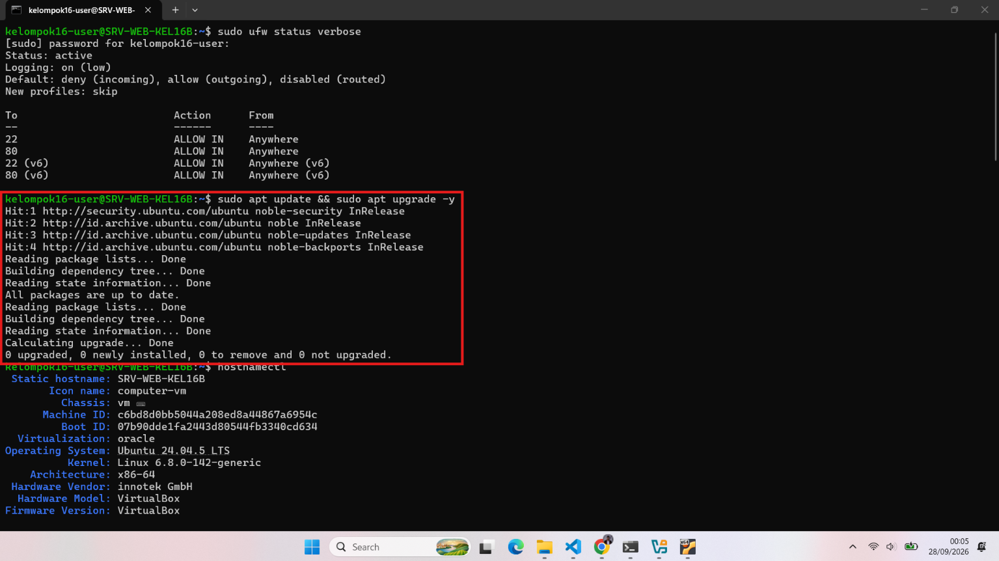
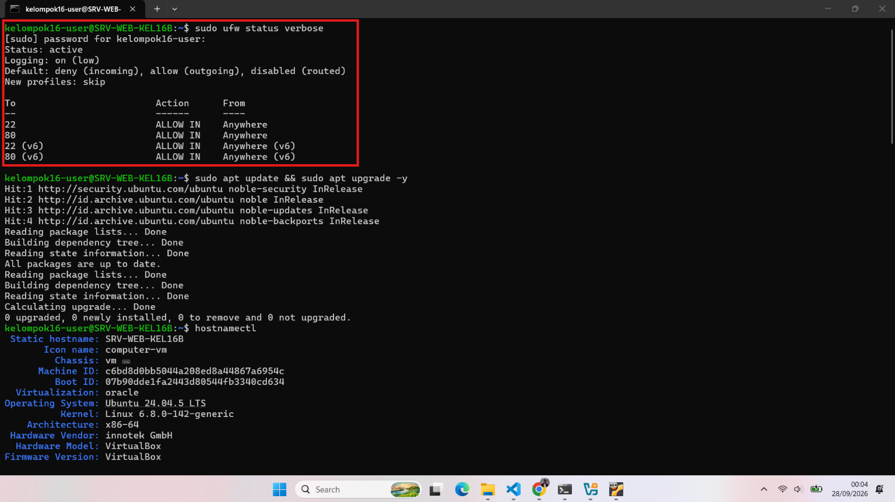
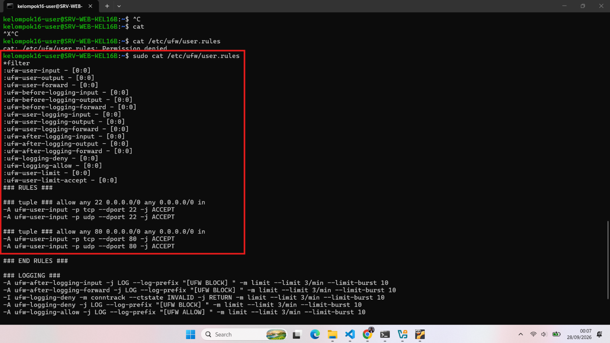
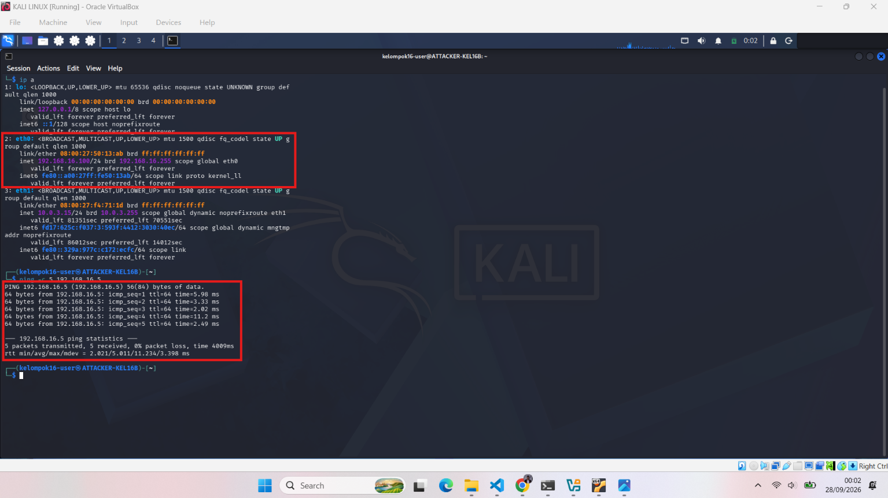

# Baseline Report - Fase 1 (Hardening Review)
## Kelompok 16

**Skenario:** Simulasi serangan web server pada jaringan berskala kecil.
**Tanggal Demo:** Minggu ke-7

---

## 1. Identitas Sistem

| Node | Hostname | IP Address | OS |
|---|---|---|---|
| Target Server | SRV-WEB-KEL16B | 192.168.16.5 | Ubuntu Server 24.04.5 LTS + DVWA (Damn Vulnerable Web App) |
| Attacker Node | ATTACKER-KEL16B | 192.168.16.100 | Kali Linux |
| Monitoring Node | MONITORING-KEL16B | 192.168.16.200 | Security Onion |

> Referensi topologi lengkap: lihat `docs/design/topology.png` dan `docs/design/ip_plan.md`

**Verifikasi identitas Target Server** (`hostnamectl`):
- Static hostname: `SRV-WEB-KEL16B`
- Operating System: Ubuntu 24.04.5 LTS
- Kernel: Linux 6.8.0-142-generic
- Virtualization: Oracle (VirtualBox)



---

## 2. Network Hardening

**Firewall (UFW) di Target Server — status aktif:**

```
Status: active
Logging: on (low)
Default: deny (incoming), allow (outgoing), disabled (routed)

To          Action      From
--          ------      ----
22          ALLOW IN    Anywhere
80          ALLOW IN    Anywhere
22 (v6)     ALLOW IN    Anywhere (v6)
80 (v6)     ALLOW IN    Anywhere (v6)
```



**Aturan detail** (`/etc/ufw/user.rules`):

```
### tuple ### allow any 22 0.0.0.0/0 any 0.0.0.0/0 in
-A ufw-user-input -p tcp --dport 22 -j ACCEPT
-A ufw-user-input -p udp --dport 22 -j ACCEPT

### tuple ### allow any 80 0.0.0.0/0 any 0.0.0.0/0 in
-A ufw-user-input -p tcp --dport 80 -j ACCEPT
-A ufw-user-input -p udp --dport 80 -j ACCEPT
```

**Alasan pemilihan port:**
- **Port 22 (SSH)** dibuka untuk keperluan administrasi jarak jauh oleh Lead/Blue Team.
- **Port 80 (HTTP)** dibuka karena merupakan port utama layanan DVWA (web app target serangan) yang harus bisa diakses oleh Attacker Node sesuai skenario.
- Semua port lain ditutup secara default (`deny incoming`) untuk meminimalkan permukaan serangan (attack surface) yang tidak relevan dengan skenario.

---

## 3. System Hardening

- [ ] **Service tidak perlu dinonaktifkan** — *belum dilakukan/didokumentasikan, akan dilengkapi.*
- [x] **User non-root untuk operasional** — seluruh perintah dijalankan menggunakan user `kelompok16-user` dengan akses `sudo`, bukan login langsung sebagai `root`.
- [x] **Security patch diupdate** — dijalankan `sudo apt update && sudo apt upgrade -y`, hasil: seluruh paket sudah up to date (`0 upgraded, 0 newly installed, 0 to remove and 0 not upgraded`).

**Bukti update patch:**

```
Hit:1 http://security.ubuntu.com/ubuntu noble-security InRelease
Hit:2 http://id.archive.ubuntu.com/ubuntu noble InRelease
Hit:3 http://id.archive.ubuntu.com/ubuntu noble-updates InRelease
Hit:4 http://id.archive.ubuntu.com/ubuntu noble-backports InRelease
...
All packages are up to date.
0 upgraded, 0 newly installed, 0 to remove and 0 not upgraded.
```



> **Catatan:** Dokumentasi penonaktifan service yang tidak perlu (mis. bluetooth, cups, avahi-daemon) masih perlu dilengkapi. Jalankan `systemctl list-unit-files --state=enabled` untuk melihat daftar service aktif, lalu nonaktifkan yang tidak relevan dengan fungsi web server.

---

## 4. Verifikasi Logging (Security Onion)

**Tujuan:** Membuktikan bahwa Monitoring Node berhasil merekam aktivitas jaringan sebelum fase serangan dimulai.

**Prosedur pengujian yang sudah dilakukan:**

1. Konfigurasi IP Attacker Node (`192.168.16.100`) diverifikasi:
```
2: eth0: <BROADCAST,MULTICAST,UP,LOWER_UP> mtu 1500 ...
    inet 192.168.16.100/24 brd 192.168.16.255 scope global eth0
```

2. Ping dari Attacker Node (192.168.16.100) ke Target Server (192.168.16.5):
```
PING 192.168.16.5 (192.168.16.5) 56(84) bytes of data.
64 bytes from 192.168.16.5: icmp_seq=1 ttl=64 time=5.98 ms
64 bytes from 192.168.16.5: icmp_seq=2 ttl=64 time=3.33 ms
64 bytes from 192.168.16.5: icmp_seq=3 ttl=64 time=2.02 ms
64 bytes from 192.168.16.5: icmp_seq=4 ttl=64 time=11.2 ms
64 bytes from 192.168.16.5: icmp_seq=5 ttl=64 time=2.49 ms

--- 192.168.16.5 ping statistics ---
5 packets transmitted, 5 received, 0% packet loss, time 4009ms
```



3. **Verifikasi di dashboard Sguil/Squert (Security Onion):** *(belum dilampirkan)*

| Timestamp | IP Asal | IP Tujuan | Jenis Aktivitas |
|---|---|---|---|
| *(belum diisi)* | 192.168.16.100 | 192.168.16.5 | ICMP (Ping) |

> ⚠️ **Belum lengkap:** Screenshot di atas hanya membuktikan bahwa trafik ICMP berhasil dikirim dari Attacker ke Target.

---

## 5. Kesimpulan Fase Baseline

Target Server (SRV-WEB-KEL16B) telah melalui tahap network hardening dengan firewall UFW aktif yang membatasi akses hanya pada port 22 (SSH) dan 80 (HTTP), serta seluruh security patch sistem telah diperbarui. Operasional sistem menggunakan user non-root (`kelompok16-user`) dengan akses sudo. Konektivitas antar-node (Attacker ↔ Target) telah diverifikasi berjalan lancar melalui pengujian ping.

